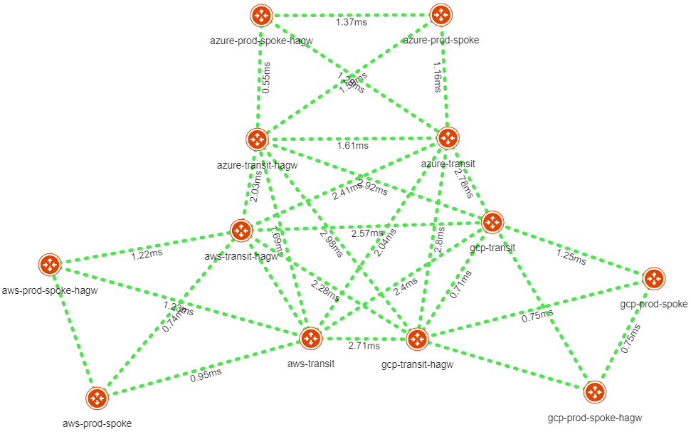

# Aviatrix MCNA

Terraform codes to setup Aviatrix Multi-Cloud Networking Architecture using Aviatrix modules across AWS, Azure and GCP.



## Instructions

Set the following environment variables:
Variables | Description
--- | ---
AVIATRIX_CONTROLLER_IP | Aviatrix Controller IP or FQDN 
AVIATRIX_USERNAME | Aviatrix Controller Username
AVIATRIX_PASSWORD | Aviatrix Controller Password
TF_VAR_aws_account | AWS Aviatrix Account 
TF_VAR_azure_account | Azure Aviatrix Account
TF_VAR_gcp_account | GCP Aviatrix Account

### Set environment variables in local shell:
```sh
$ export AVIATRIX_CONTROLLER_IP="aviatrixcontroller.aviatrix.lab"
$ export AVIATRIX_USERNAME="admin"
$ export AVIATRIX_PASSWORD="Aviatrix123!"
$ export TF_VAR_aws_account="AWS-Aviatrix-Account"
$ export TF_VAR_azure_account="Azure-Aviatrix-Account"
$ export TF_VAR_gcp_account="GCP-Aviatrix-Account"
```

### Terraform workflow:
```sh
$ terraform init
$ terraform plan
$ terraform apply -auto-approve
```